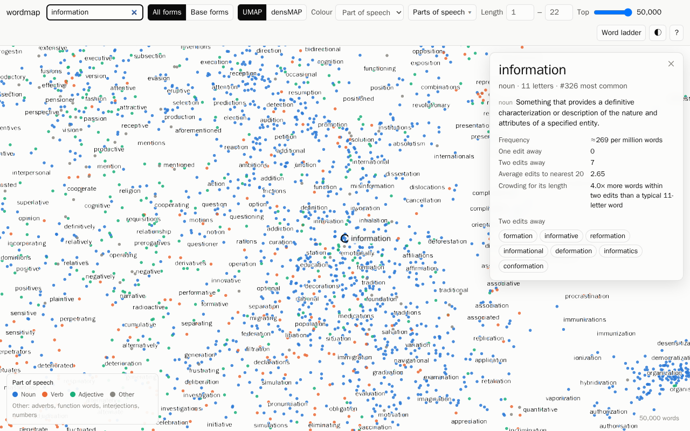
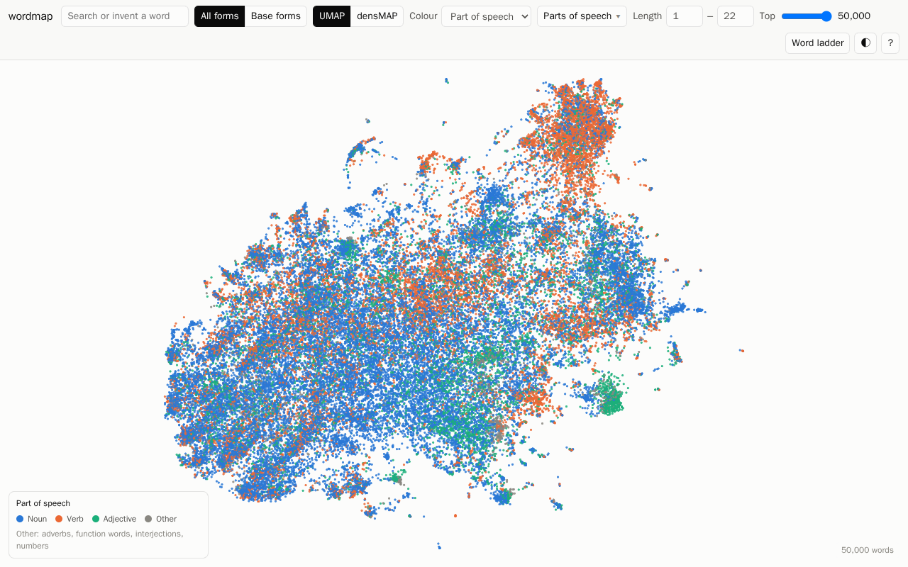

# wordmap

An interactive map of the 50,000 most common English words, laid out so that words a few
letter edits apart sit near each other.

The distance between two words is their [Levenshtein distance][lev]: the number of single-letter
insertions, deletions or substitutions that turn one into the other (*cat → cot* is 1,
*cat → coast* is 2). Every pair of words is compared exactly. [UMAP][umap] then turns each word's
nearest neighbours into a 2-D map, which is drawn with [deck.gl][deck] as a static site.



- **Hover** a dot for the word, its part of speech and a short definition. **Zoom in** and the
  words appear as labels.
- **Search** for a word to fly to it. Its panel lists the words truly one and two edits away,
  and lines on the map point to the one-edit ones.
- **Type anything else**, a made-up word like *blorf*, and a ring marks where it would sit: on the
  most central of its closest real words (*“blorf” by born*).
- **Colour** by part of speech, word length, frequency, or how crowded a word's neighbourhood is
  for its length. **Filter** by part of speech, length, or to the most common *N* words.
- **Switch** between all word forms and base forms only (*run* but not *runs*, *ran*,
  *running*), and between UMAP and densMAP layouts. Points animate between views.
- **Word ladder** finds the shortest chain of one-edit steps between two words
  (*cat → cot → cog → dog*).

## What the map shows (and doesn't)



The strongest pattern is **length**. Two words can't be closer than their difference in length,
so the map runs from short words at one end to long words at the other. The clumps inside that
gradient are mostly **shared endings**, because a long shared ending means many letters in common.
Short endings barely hold words together:

| ending | words | share of each word's 15 nearest dots with the same ending | share of all words |
|---|---|---|---|
| *-ing* | 4,478 | 73% | 9% |
| *-able* | 457 | 73% | 0.9% |
| *-ful* | 121 | 62% | 0.2% |
| *-tion* | 1,228 | 49% | 2.5% |
| *-ness* | 321 | 48% | 0.6% |
| *-ly* | 1,617 | 19% | 3.2% |
| *-ed* | 5,074 | 27% | 10% |
| *-s* | 12,885 | 32% | 26% |

Short words sit in a dense mass (a typical 3-letter word has 18 words one edit away), while 55% of
words with 10 or more letters have no word one edit away at all.

A 2-D picture can't keep 50,000 × 50,000 distances. UMAP keeps local neighbourhoods and gives up on
long distances, and even locally it is approximate. On this vocabulary, about 17% of the 15 words
drawn nearest to a word are among its truly closest words. Two runs of UMAP with different random
seeds agree on only about 14% of each word's on-screen neighbours. **Read regions, not individual
adjacencies.** The details panel always shows a word's true neighbours.

**densMAP** (UMAP with a density-preserving term) makes on-screen spacing follow how crowded each
neighbourhood really is. That shows best where spelling allows many near-variants and where it
doesn't. On this vocabulary, it raises the rank correlation between a word's on-screen spacing
and its true neighbourhood density (OLD20, the mean edit distance to its 20 closest words) from
0.25 to 0.74. The cost is locality: only 7.6% of on-screen neighbours are true near neighbours,
against 17.2% for UMAP. It's offered as the second layout.

## Vocabulary

Candidates come from [wordfreq][wordfreq]'s English list, ranked by frequency, keeping plain
`a–z` tokens. In order:

1. **Real words only.** The word must be in the [English Speller Database][esdb] (ESDB, formerly
   SCOWL) at size ≤ 70 ("large" dictionary). This drops typos (*rythm*, *strenght*),
   abbreviations, rare variant spellings, programmer slang and Roman numerals. Words ESDB tags as
   offensive (ethnic slurs) are dropped; ordinary profanity stays.
2. **No proper names.** wordfreq lowercases everything, so *mark* also counts Mark. SUBTLEX-US tags
   every occurrence with a part of speech, so each word's frequency is scaled by its non-name
   share, and words used almost only as names (under 2 non-name uses per million) are dropped.
   *Mark*, *bill* and *jack* stay, ranked by their ordinary use; *harry* and *smith* go.
3. **No bare letters or symbols.** Single letters other than *a* and *i* are dropped, as are words
   whose every Wiktionary sense is an abbreviation or symbol (*mg*, *cd*).
4. **Must have an English Wiktionary entry**, which supplies definitions.

The 50,000 most frequent survivors form the vocabulary. The rarest are around Zipf 2, about once
per 100 million words. **Base forms** (30,177 words) are the words that ESDB lists as a lemma
under their dominant part of speech, rather than as an inflection of another word.

**Part of speech** is the dominant tag in [SUBTLEX-US][subtlex] (subtitle usage, ignoring name
uses), falling back to Wiktionary for words SUBTLEX doesn't cover. **Definitions** are the first
sense in [Wiktionary][wiktionary] for that part of speech, skipping obsolete, archaic and rare
senses when there's another. Glosses that only point elsewhere ("plural of *cat*",
"Alternative spelling of *OK*") also show the target's definition.

## Neighbours and ties

Levenshtein distances are small integers, so most words have more neighbours tied at the cutoff
than a neighbour list has room for (*cat* has 31 words one edit away). Ties are broken toward
the more frequent word. `pipeline/experiments/ties.py` compares that with random tie-breaks on
this vocabulary, and the rule makes no measurable difference:

| tie-break | UMAP seed | on-screen neighbours that are true near neighbours | global Spearman (map vs edit distance) | most lists any word appears in |
|---|---|---|---|---|
| frequency | 0 | 16.8% | 0.28 | 252 |
| frequency | 1 | 17.2% | 0.28 | 252 |
| random (seed 0) | 0 | 17.2% | 0.28 | 226 |
| random (seed 1) | 0 | 17.4% | 0.27 | 245 |

Changing only the UMAP seed moves on-screen neighbourhoods about as much as changing the
tie-break rule does (13.7% vs 11.6% of 2-D neighbours shared). The fine arrangement is arbitrary
either way.

## Running it

Requirements: [uv](https://docs.astral.sh/uv/), [just](https://just.systems/), Node 20+, git and
make. Rebuilding the data takes about 3.5 GB of disk.

```sh
just setup      # Python and npm dependencies
just dev        # serve the site at http://127.0.0.1:5173
just build      # static site in web/dist/ — copy it to any static host
```

The built map data is committed in `web/public/data/`, so the site runs without the data
pipeline. To rebuild the data from the original sources:

```sh
just pipeline   # all steps below: about 10 minutes on 4 cores, plus the ~3 GB download
```

| step | what it does |
|---|---|
| `just fetch` | downloads SUBTLEX-US and the Wiktionary dump (~3 GB), builds ESDB from a pinned commit |
| `just wiktionary` | pulls the English entries out of the dump (~2 min) |
| `just vocab` | chooses the 50,000 words; part of speech, base forms, definitions |
| `just neighbors` | exact all-pairs Levenshtein (rapidfuzz), neighbour lists, crowding measures |
| `just layout` | UMAP and densMAP for all forms and base forms, aligned to each other |
| `just export` | writes `web/public/data/` |

## Sources and licences

The code is MIT-licensed (see `LICENSE`). The map data in `web/public/data/` is derived from the
sources below and is shared under [CC BY-SA 4.0][ccbysa] (see `web/public/data/LICENSE.md`).

| source | used for | licence |
|---|---|---|
| [wordfreq][wordfreq] (Robyn Speer) | word frequencies | data CC BY-SA 4.0 |
| [English Speller Database][esdb] (Kevin Atkinson) | real-word filter, lemmas, slur tags | MIT-like |
| [SUBTLEX-US][subtlex] (Brysbaert, New & Keuleers 2012) | part of speech, name shares | CC BY-SA |
| [Wiktionary][wiktionary] via [kaikki.org][kaikki] / Wiktextract | definitions | CC BY-SA 4.0 / GFDL |

[lev]: https://en.wikipedia.org/wiki/Levenshtein_distance
[umap]: https://umap-learn.readthedocs.io/
[deck]: https://deck.gl/
[wordfreq]: https://github.com/rspeer/wordfreq
[esdb]: https://github.com/en-wl/wordlist
[subtlex]: https://www.ugent.be/pp/experimentele-psychologie/en/research/documents/subtlexus
[wiktionary]: https://en.wiktionary.org/
[kaikki]: https://kaikki.org/
[ccbysa]: https://creativecommons.org/licenses/by-sa/4.0/
